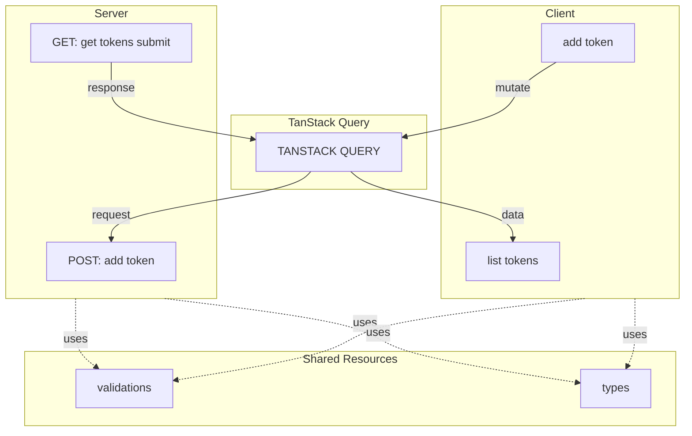

# Token Management Service

A minimal Next.js service for managing user access tokens with scopes and expiration.

## Quick Start

```bash
# Install dependencies
npm install

# Copy environment file
mv .env.example .env


# Start development server
npm run dev
```

Visit `http://localhost:3000` to access the application.

## Architecture

The application follows a clean separation between client and server, with shared types and validations:



**Key Components:**
- **Client**: React components with form validation
- **TanStack Query**: Data fetching and state management
- **Server**: Next.js API routes with in-memory storage
- **Shared**: Common types and Zod validation schemas

## API Endpoints

### POST /api/tokens

Create a new token for a user.

**Request:**
```bash
curl -X POST http://localhost:3000/api/tokens \
  -H "Content-Type: application/json" \
  -H "X-API-Key: your_api_key_here" \
  -d '{
    "userId": "123",
    "scopes": ["read", "write"],
    "expiresInMinutes": 60
  }'
```

**Response:**
```json
{
  "id": "uuid-here",
  "userId": "123",
  "scopes": ["read", "write"],
  "createdAt": "2025-01-01T10:00:00.000Z",
  "expiresAt": "2025-01-01T11:00:00.000Z",
  "token": "uuid-here"
}
```

### GET /api/tokens?userId=123

Returns array of non-expired tokens for a user.

**Request:**
```bash
curl http://localhost:3000/api/tokens?userId=123 \
  -H "X-API-Key: your_api_key_here"
```

**Response:**
```json
[
  {
    "id": "uuid-here",
    "userId": "123",
    "scopes": ["read", "write"],
    "createdAt": "2025-01-01T10:00:00.000Z",
    "expiresAt": "2025-01-01T11:00:00.000Z",
    "token": "uuid-here"
  }
]
```

## Tech Stack

- **Framework**: Next.js 16 (App Router)
- **Language**: TypeScript
- **Validation**: Zod schemas (shared frontend/backend)
- **State Management**: TanStack Query
- **Storage**: In-memory (Map-based, O(1) lookup)
- **Testing**: Jest
- **UI**: React Hook Form, Radix UI, Tailwind CSS

## Testing

```bash
npm test
```

Tests are located next to implementation files (e.g., `app/api/tokens/utils/getActiveTokens.test.ts`).

## Implementation Details

### Core Features

✅ Full TypeScript with strict types  
✅ Zod validation for all inputs  
✅ Proper HTTP status codes (201, 400, 401, 500)  
✅ API key authentication  
✅ Frontend UI with form validation  
✅ Unit tests for token expiry logic  

### Assumptions & Simplifications

**Storage**
- In-memory Map storage (data lost on server restart)
- Optimized with O(1) user-token lookup via indexed mapping

**Validation**
- Scopes restricted to `['read', 'write']` (not arbitrary strings)
- User ID max length: 100 characters
- Expiry max: 1 year (525,600 minutes)

**Format**
- Token IDs use UUID format (not `token_abc123` format from examples)

**Simplifications**
- No Dockerfile included
- 500ms API delay for demo purposes (loading states)
- Single schema reused for frontend forms and backend API
